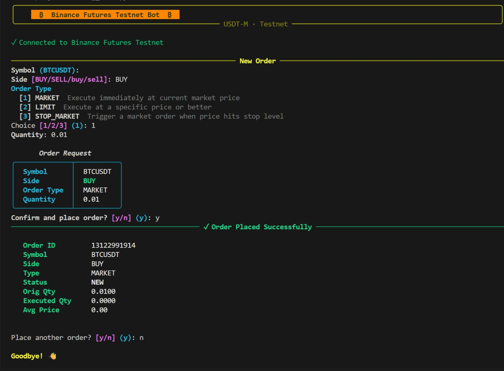
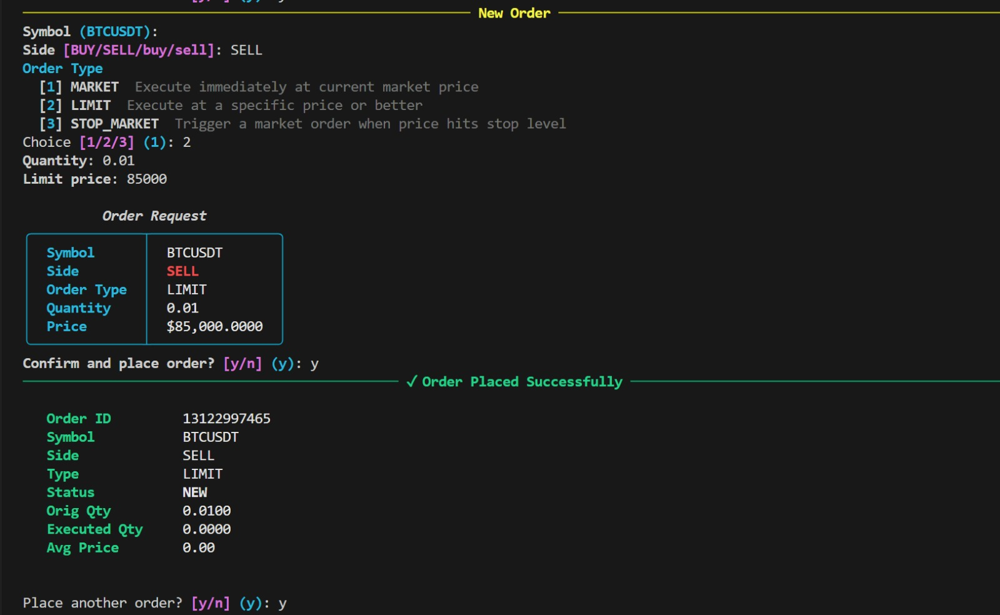
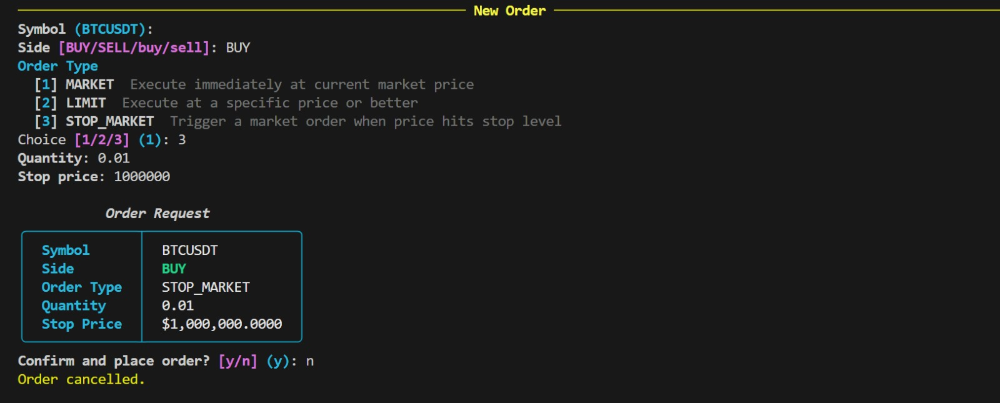

# Python Binance Futures Testnet Bot

[](https://www.python.org/)
[](LICENSE)

A clean, professional Python trading bot for **Binance USDT-M Futures Testnet**.
It supports **MARKET**, **LIMIT**, and **STOP_MARKET** orders through both an interactive terminal interface and script-friendly CLI flags.

## Table of Contents

- [Why This Project](#why-this-project)
- [Key Features](#key-features)
- [Project Architecture](#project-architecture)
- [Demo](#demo)
- [Getting Started](#getting-started)
- [Usage](#usage)
- [CLI Reference](#cli-reference)
- [Logging](#logging)
- [Error Handling](#error-handling)
- [Security Best Practices](#security-best-practices)
- [Assumptions and Scope](#assumptions-and-scope)
- [Roadmap](#roadmap)
- [Contributing](#contributing)
- [License](#license)
- [Disclaimer](#disclaimer)

## Why This Project

This repository demonstrates how to build a reliable trading CLI around Binance Futures Testnet using a clear layered architecture:

- **Client layer** for authenticated Binance REST calls
- **Order layer** for business logic and normalized responses
- **CLI layer** for both interactive and one-command workflows
- **Validation and logging** to keep behavior predictable and traceable

It is designed for learning, experimentation, and showcasing practical Python engineering practices in a finance/automation context.

## Key Features

| Capability | Details |
|---|---|
| Supported order types | MARKET, LIMIT (GTC), STOP_MARKET |
| Trade sides | BUY, SELL |
| Interface modes | Interactive Rich terminal UI and argparse CLI flags |
| Credentials flow | `.env` file, environment variables, or masked interactive prompt |
| Logging | Rotating file logs (`logs/trading_bot.log`) with structured output |
| API integration | Direct REST calls via `requests` (no Binance SDK dependency) |
| Resilience | Validation, Binance API error mapping, timeout/network handling |

## Project Architecture

```text
Python-Binance-Bot/
├── bot/
│   ├── __init__.py
│   ├── __main__.py          # python -m bot entrypoint
│   ├── cli.py               # Interactive + argparse interface (Rich)
│   ├── client.py            # Binance Futures REST client (signing + requests)
│   ├── orders.py            # Order management and normalized OrderResult
│   ├── validators.py        # Input validation helpers
│   └── logging_config.py    # Rotating log configuration
├── demo/
│   ├── market.jpeg
│   ├── limit.jpeg
│   └── stop.jpeg
├── logs/                    # Auto-created / updated runtime logs
├── requirements.txt
├── README.md
└── LICENSE
```

## Demo

### MARKET Order Demo



### LIMIT Order Demo



### STOP_MARKET Order Demo



## Getting Started

### 1. Create Binance Futures Testnet API Keys

1. Visit [https://testnet.binancefuture.com](https://testnet.binancefuture.com)
2. Sign in and open **API Management**
3. Create a key pair and securely save:
   - `BINANCE_API_KEY`
   - `BINANCE_API_SECRET`

### 2. Clone and Install Dependencies

```bash
git clone https://github.com/adityamoghaa/Python-Binance-Bot.git
cd Python-Binance-Bot
python3 -m venv .venv
source .venv/bin/activate
pip install -r requirements.txt
```

### 3. Configure Credentials

Create a `.env` file in the repository root:

```ini
BINANCE_API_KEY=your_api_key_here
BINANCE_API_SECRET=your_api_secret_here
```

If `.env` is not provided, the app falls back to environment variables, then asks for credentials interactively.

## Usage

### Interactive Mode (Recommended)

```bash
python -m bot
```

This launches a guided Rich interface where you can select symbol, side, order type, quantity, and optional price inputs.

### One-Command CLI Mode

```bash
# MARKET BUY
python -m bot --symbol BTCUSDT --side BUY --type MARKET --qty 0.01

# LIMIT SELL
python -m bot --symbol ETHUSDT --side SELL --type LIMIT --qty 0.10 --price 3500

# STOP_MARKET BUY
python -m bot --symbol BTCUSDT --side BUY --type STOP_MARKET --qty 0.01 --stop-price 96000
```

## CLI Reference

| Flag | Description |
|---|---|
| `--symbol` | Trading pair, e.g. `BTCUSDT` |
| `--side` | `BUY` or `SELL` |
| `--type` | `MARKET`, `LIMIT`, or `STOP_MARKET` |
| `--qty` | Order quantity |
| `--price` | Required for `LIMIT` orders |
| `--stop-price` | Required for `STOP_MARKET` orders |
| `--api-key` | API key override (or env var) |
| `--api-secret` | API secret override (or env var) |
| `--log-level` | `DEBUG`, `INFO`, `WARNING`, `ERROR` |

## Logging

All runtime activity is logged to:

```text
logs/trading_bot.log
```

Logging behavior:

- Rotating log file (2 MB each, up to 5 backups)
- Includes request flow, validation failures, and API error details
- Console remains clean (shows only error-level logs)

## Error Handling

The bot explicitly handles:

- Invalid user inputs (symbol, side, quantity, price)
- Binance API errors (code + message)
- Network failures and request timeouts
- Unexpected runtime exceptions with clear user-facing messages

## Security Best Practices

- Never commit API keys or secrets
- Use testnet credentials only in this project
- Keep credentials in `.env` or environment variables
- Rotate keys periodically and revoke compromised keys immediately

## Assumptions and Scope

- Target exchange: **Binance USDT-M Futures Testnet**
- `STOP_MARKET` is implemented for trigger-based orders
- Quantity precision and exchange rule enforcement remain Binance-side authoritative
- Live trading is intentionally out of scope by default

## Roadmap

Potential future enhancements:

- Add `STOP_LIMIT` and additional order strategies
- Symbol metadata checks for step size / tick size pre-validation
- Optional retry/backoff policy for transient API/network errors
- Unit tests and CI workflow for automated quality checks

## Contributing

Contributions are welcome. Suggested workflow:

1. Fork the repository
2. Create a feature branch
3. Commit focused changes
4. Open a pull request with clear context and test steps

## License

This project is licensed under the MIT License. See [LICENSE](LICENSE) for details.

## Disclaimer

This software is for educational and testnet experimentation purposes only.
Use it at your own risk. The author is not responsible for financial loss, trading mistakes, or exchange-side behavior.
